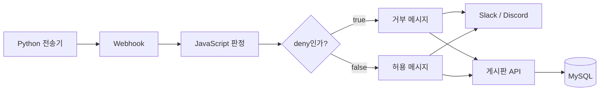
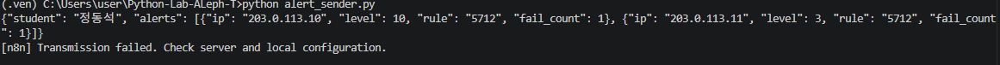
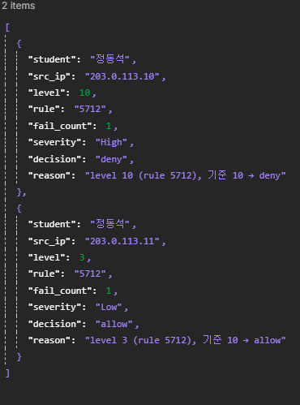
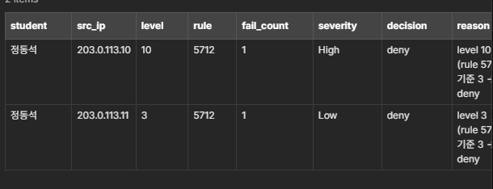
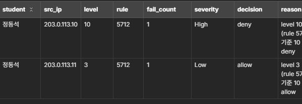
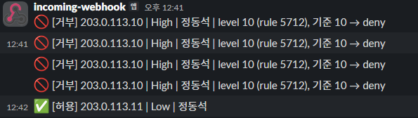
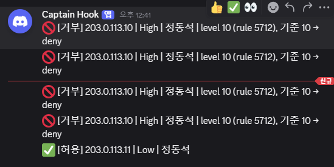
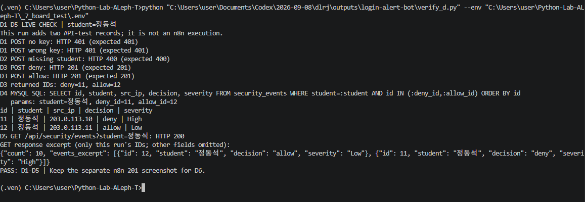
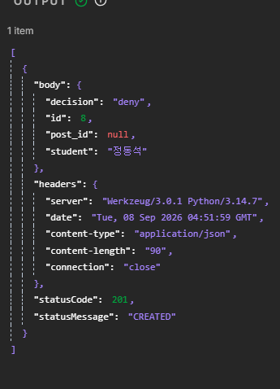
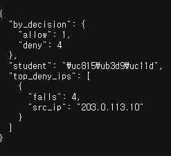

# 로그인 경보 자동화 봇

Python에서 로그인 경보를 보내면 n8n이 심각도와 허용·거부를 판정하고 메신저로 알림을 보내는 실습입니다.
Flask 게시판에 보안 이벤트 저장·조회 API와 대시보드를 구성했습니다.

- 이름: 정동석
- Code 노드 언어: JavaScript
- 알림 채널: Slack, Discord
- Telegram: 접속 불가로 미완료, 강사님께 사전 고지

## 작업 내역

1. 기존 Flask 게시판 및 MySQL 연결 구조를 확인했습니다.
2. 환경변수 설정과 보안 이벤트 모델, 인증을 사용하는 저장 API를 구성했습니다.
3. Python 전송기에 학생 식별자와 레벨 10·3 경보를 넣었습니다.
4. n8n에서 경보별 아이템 생성, JavaScript 판정, IF 분기를 구성했습니다.
5. 거부·허용 메시지를 구분하고 Slack·Discord·Telegram 및 게시판 저장 노드를 연결했습니다.
6. 메신저 HTTP 본문의 JSON 오류를 수정하고 API·MySQL 조회 결과와 메시지 도착 화면을 기록했습니다.

사용 기술: Python, requests, Flask, SQLAlchemy, MySQL, Docker, n8n, Slack, Discord.

## 구성



구성 설명용 도식입니다. 실행 캡처는 아래에 첨부합니다.

## 기능 구현 화면 및 증적

### 관제 페이지 화면


### n8n 토폴로지 화면


### A3 — 전송 실패 처리

n8n 중지 상태에서 전송 오류를 안내하며 주소나 예외 상세를 출력하지 않습니다.



### B1·B2 — 경보별 판정

두 경보를 각각 아이템으로 만들고 level 10은 High/deny, level 3은 Low/allow로 판정합니다.



### B3 — 거부 기준 변경 비교

기준 3에서는 level 3도 deny가 되며, 기준 10으로 복구하면 allow가 됩니다. severity는 독립적인 등급이므로 Low를 유지합니다.




### C2·C3·C5 — 메신저 알림

거부는 IP·심각도·학생·사유를 포함하고 허용은 짧은 문구로 보냅니다. 반복 테스트로 거부 알림이 여러 번 표시됩니다.




### D1~D5 — REST API 및 MySQL 통합 검증

`verify_d.py`가 실제 요청과 직접 SQL 조회를 수행합니다. 키 없음·잘못된 키 401, 필수값 누락 400, 정상 저장 201과 ID, 본인 허용·거부 SQL 기록, GET 200을 한 화면에 기록했습니다. GET 출력은 해당 실행 ID의 주요 필드 발췌입니다. 이 검증은 n8n 실행과 별개의 API 테스트입니다.



### D6 — n8n 게시판 저장

게시판 저장 노드의 응답에서 학생 식별자, 저장 ID 및 201 CREATED를 확인합니다.



### S1 — 학생별 요약 API

학생별 허용·거부 건수와 거부 상위 IP를 반환합니다. 현재 상위 IP의 정렬 지표는 fail_count 합계입니다.



## 실행 방법

### 설치와 설정

저장소 루트에서 다음을 실행합니다.

```powershell
python -m venv .ven
.\.ven\Scripts\python.exe -m pip install -r requirements.txt
Copy-Item _7_board_test/.env.example _7_board_test/.env
```

이미 .env가 있으면 복사 명령은 생략합니다. .env 안의 DATABASE_URL, JWT_SECRET_KEY, SECURITY_API_KEY, STUDENT, N8N_WEBHOOK_URL을 로컬에서 입력합니다.
AUTO_POST_ON_DENY는 0으로 설정합니다. PUBLIC_API_KEY는 부산 공공데이터 기능을 사용할 때만 필요합니다.
새 키는 `python -c "import secrets; print(secrets.token_hex(32))"`로 생성하고 로컬 설정에만 보관합니다.

### 실행 순서

① 켜는 것: Docker의 MySQL·n8n 및 Flask 게시판. MySQL에 my_new_board_db를 생성하고 `.\.ven\Scripts\python.exe _7_board_test/app.py`를 실행합니다.  
② 실행하는 것: n8n 테스트 수신 대기 후 새 터미널에서 `.\.ven\Scripts\python.exe alert_sender.py`를 실행합니다.  
③ 확인하는 것: POST 200, Slack·Discord 메시지, 게시판 저장 201 및 DB의 본인 허용·거부 기록을 확인합니다.  
④ 오류 확인: n8n 해당 노드 OUTPUT, Flask 터미널 및 로컬 환경변수 설정을 확인합니다.

Test URL은 실행 대기를 켠 뒤 사용하고, Production URL은 워크플로우 활성화 후 사용합니다. 주소는 로컬 .env에만 저장합니다.

### n8n 구성

- Webhook POST → Code(JavaScript, Run Once for All Items): `n8n/decision.js` 사용
- IF: `decision`이 `deny`와 같은지 비교
- 거부 text: `🚫 [거부] {{ $json.src_ip }} | {{ $json.severity }} | {{ $json.student }} | {{ $json.reason }}`
- 허용 text: `✅ [허용] {{ $json.src_ip }} | {{ $json.severity }} | {{ $json.student }}`
- 두 메시지 노드 모두 Include Other Input Fields를 켜고 All 유지
- Slack JSON 필드: text = `{{ $json.text }}`
- Discord JSON 필드: content = `{{ $json.text }}`
- Telegram은 미완료. 사용할 경우 text와 수신 chat_id 필요
- 게시판 저장: 컨테이너에서 호스트의 5000번 포트에 있는 `/api/security/events`로 POST. Header Auth Credential의 X-API-Key에 서버 SECURITY_API_KEY와 같은 값을 설정
- 게시판 본문: Using JSON의 Expression에서 `{{ $json }}`

메신저 주소·토큰은 공개 워크플로우 파일에 포함하지 않습니다. 실제 워크플로우 Export JSON은 아직 이 저장소에 포함하지 않았습니다.

## 막혔던 점과 해결 방법

1. **Flask 모듈 없음**: 활성 가상환경에 requirements.txt 의존성을 설치했습니다.
2. **Webhook 404**: Test URL 수신 대기를 켠 뒤 다시 전송해 200 응답을 확인했습니다.
3. **메신저 JSON 오류**: JSON 전체 입력란에 메시지 문자열을 넣었던 것을 Using Fields Below로 바꾸고 플랫폼별 필드명을 설정했습니다. Telegram은 이후 chat_id 누락 오류가 남았습니다.

Code 노드는 JavaScript를 사용했습니다. Python Code 실행 실패를 실제로 경험했다는 증적은 없습니다.

## AI 활용

- AI에 맡긴 일: 기존 코드 점검, 전송기 작성, 설정 분리, API 테스트, n8n 설정 안내, README 초안.
- 직접 수행한 일: VS Code 환경 구성, n8n 노드 설정과 연결, Python 전송 실행, 오류 화면 확인.
- 직접 결정한 일: Telegram 이용 불가 상황 공유 및 제출 기준 선택.
- AI 제안을 따르지 않은 일: Telegram 추가 복구·대체 연동은 진행하지 않고 접속 불가 상황을 강사님께 사전 고지한 뒤 제출하기로 했습니다.

## 비밀값 관리

.env는 Git에서 제외하고 .env.example의 값은 모두 비웠습니다. 로그·가상환경·캐시도 제외했습니다.
웹훅 주소가 표시된 전체 워크플로우 캡처는 포함하지 않았습니다. 비밀값이 포함된 설정과 로그는 제출하지 않습니다.

## API·DB 검증 재실행

```powershell
.\.ven\Scripts\python.exe verify_d.py
```

로컬 .env를 읽고 증적용 허용·거부 이벤트를 두 건 추가합니다. 비밀번호와 API 키는 출력하지 않습니다.
